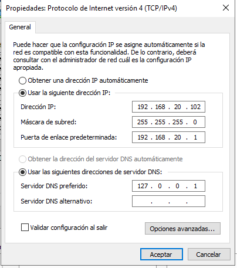
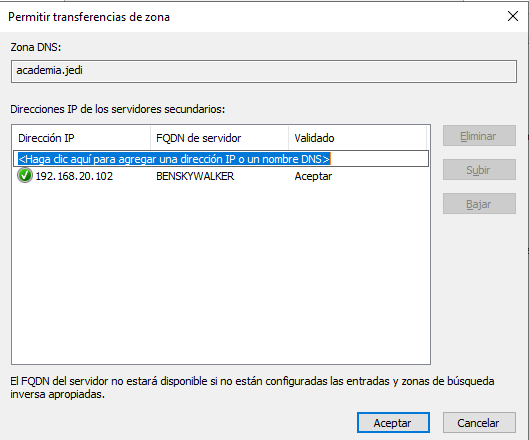
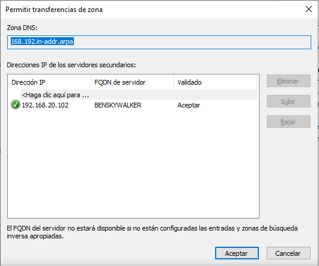
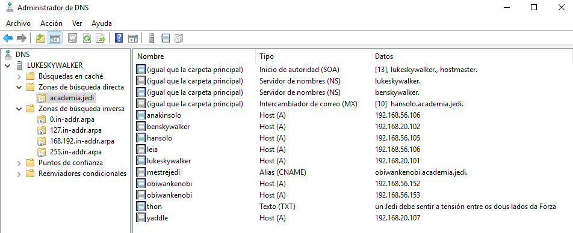
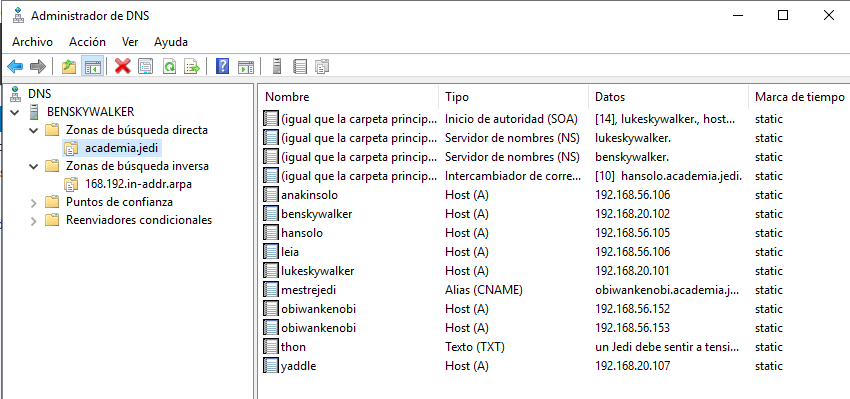
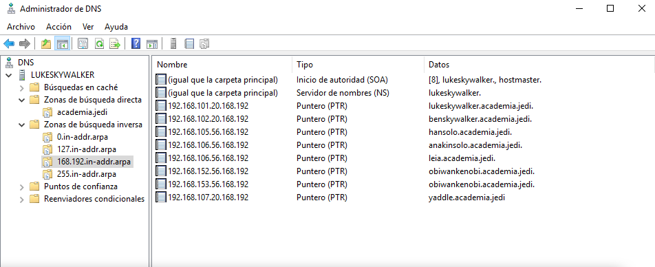
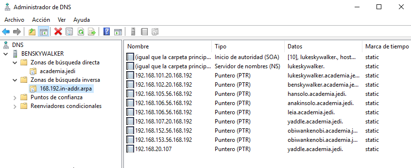

# 1.4 Instalación de zonas secundarias con Windows Server.

1. Tomaremos a máquina benskywalker, e configuraremola para ser servidor secundario, tanto da zona primaria academia.jedi de resolución directa como de resolución inversa. Captura a configuración en ambalas dúas máquinas.

- Configuración TCP/IP de Benskywalker:

Creamos una zona secundaria academia.jedi en benskywalker

- Configuramos la transferencia de zona en las propiedades de academia.jedi en lukeskywalker:

Creamos una zona secundaria da inversa 168.192.in-addr.arpa en benskywalker (y permitimos la transferencia de zona)

- Configuramos la transferencia de zona en las propiedades de 168.192.in-addr.arpa  en lukeskywalker:

2. Engade un rexistro tipo A (yaddle 192.168.20.107) na zona de resolución directa e tamén na de resolución inversa. Adxunta captura dos rexistros da zona unha vez feita a transferencia.

- academia.jedi 
   -  lukeskywalker:

    

    -   benskywalker:

    

- 168.192.in-addr.arpa 
    -  lukeskywalker:

    

    -   benskywalker:

    

- Los 2 últimos puntos de la tarea no se pueden llevar a cabo porque no lo permite VirtualBox.